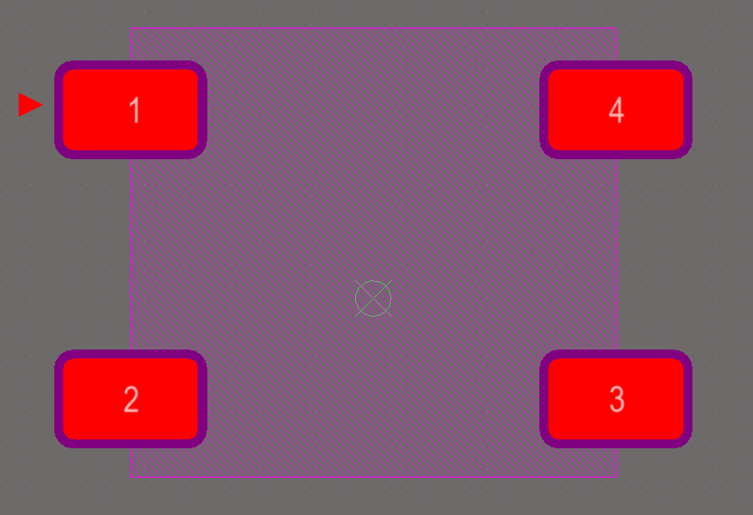
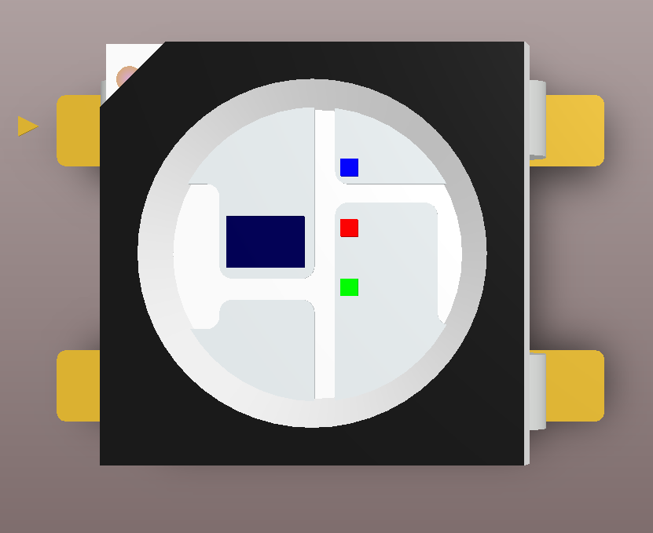
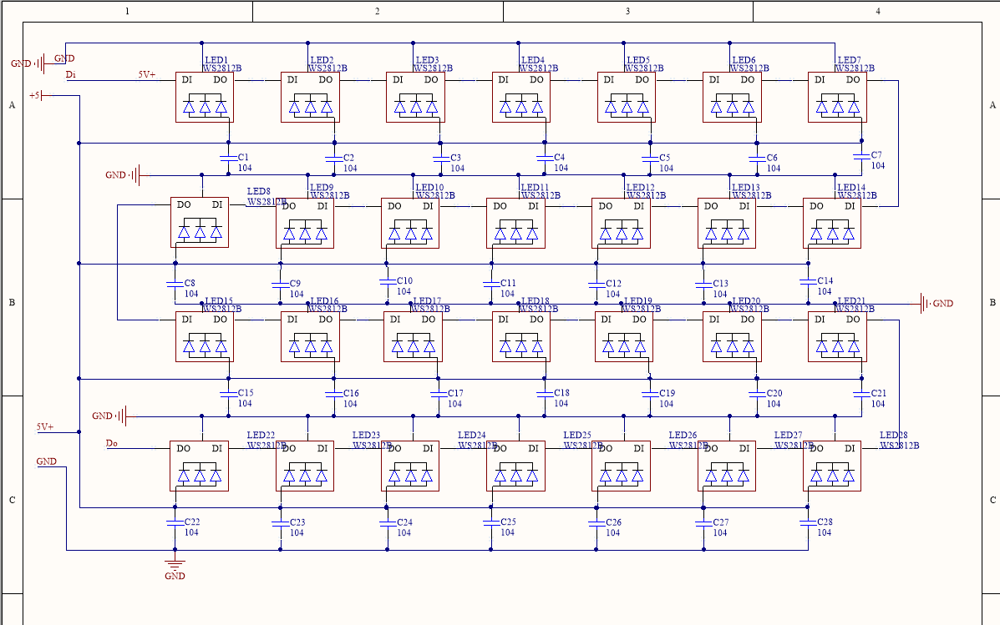
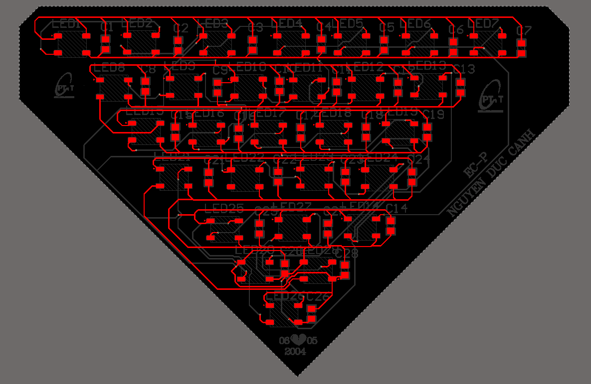
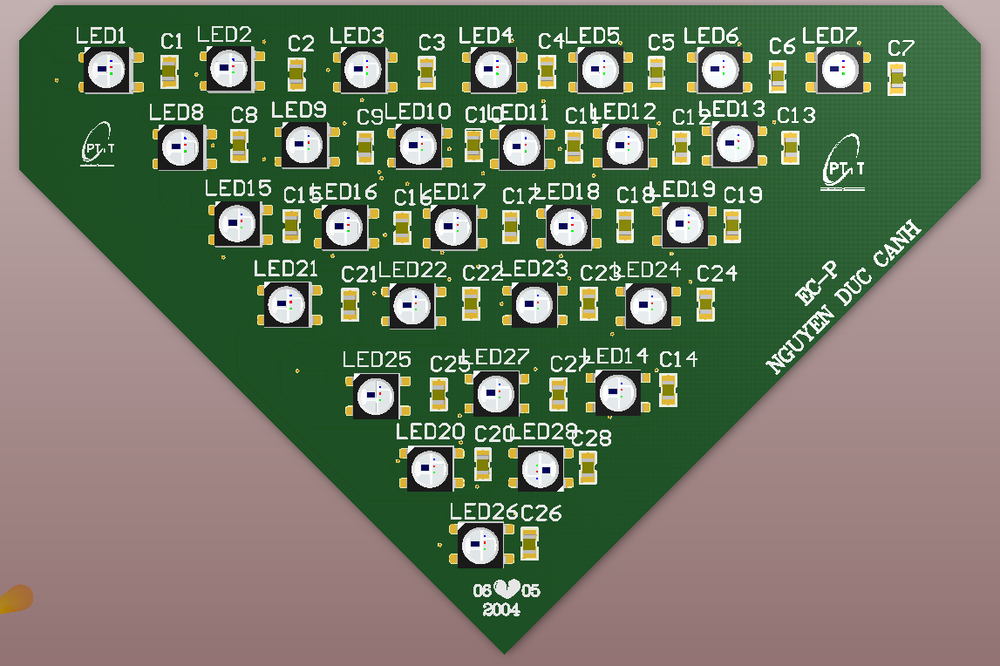

# ELE-D22-NguyenDucCanh - BÁO CÁO MÔN ALTIUM NGÀY 24/04/2024

# A. CÔNG VIỆC ĐÃ LÀM

- Vẽ thư viện và add 3D cho LED WS2812B

- Vẽ nguyên lý cho LED WS2812B

# B. BÀI TẬP

- Hoàn thiện PCB cho LED và layer

# C. KHÓ KHĂN GẶP PHẢI 

- Không