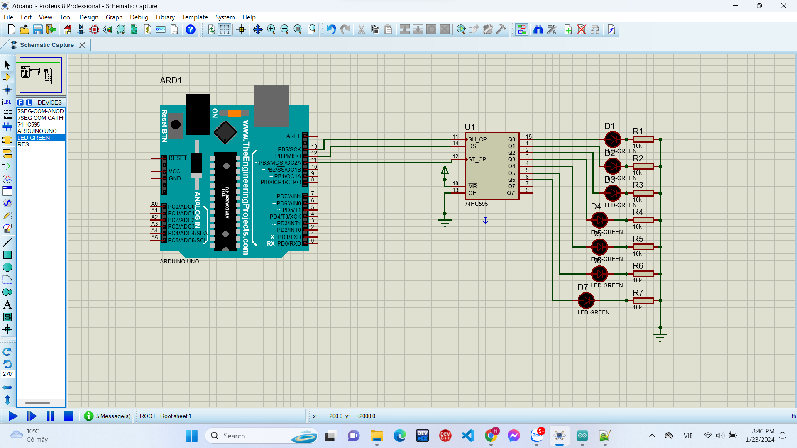
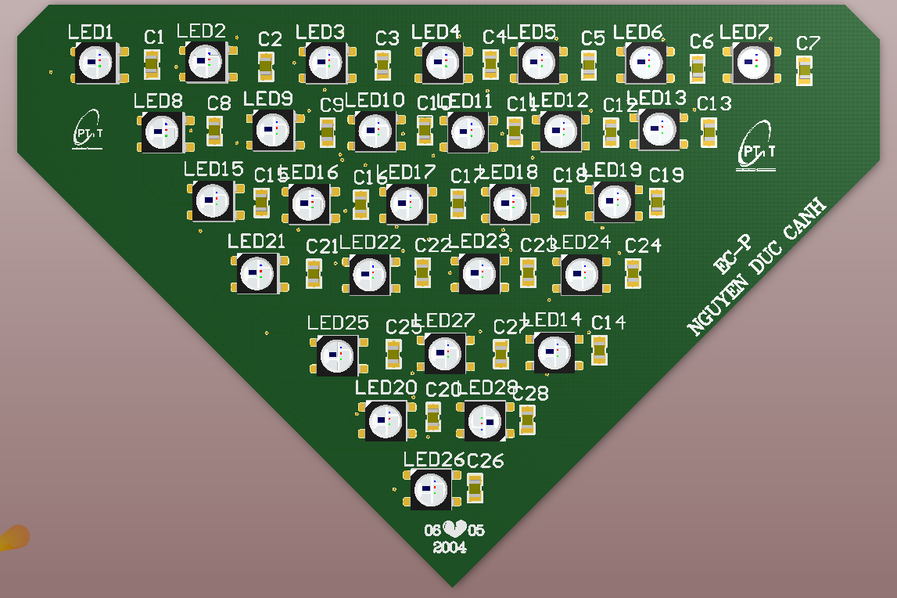
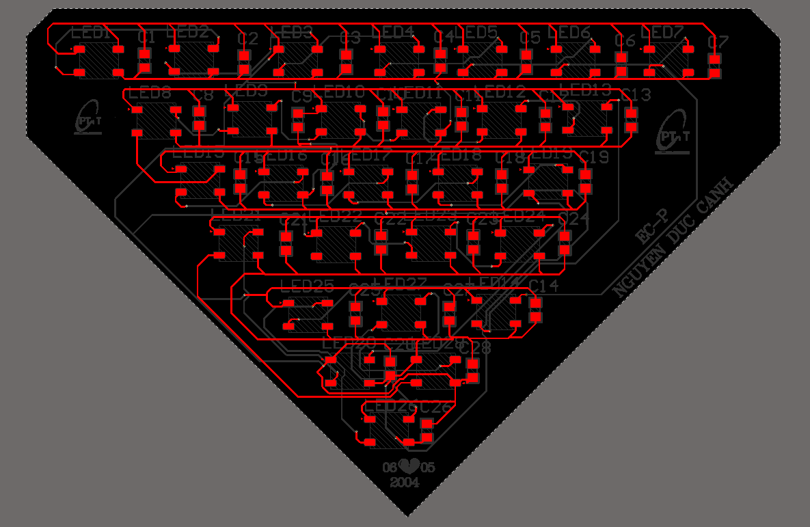
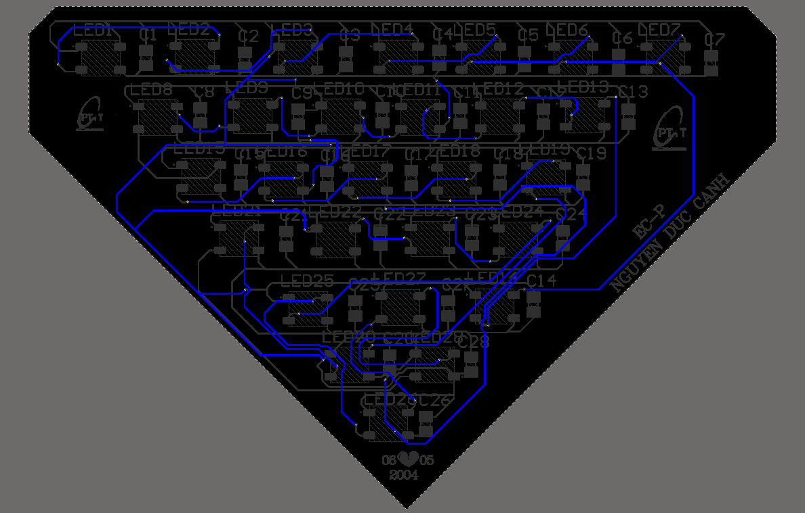
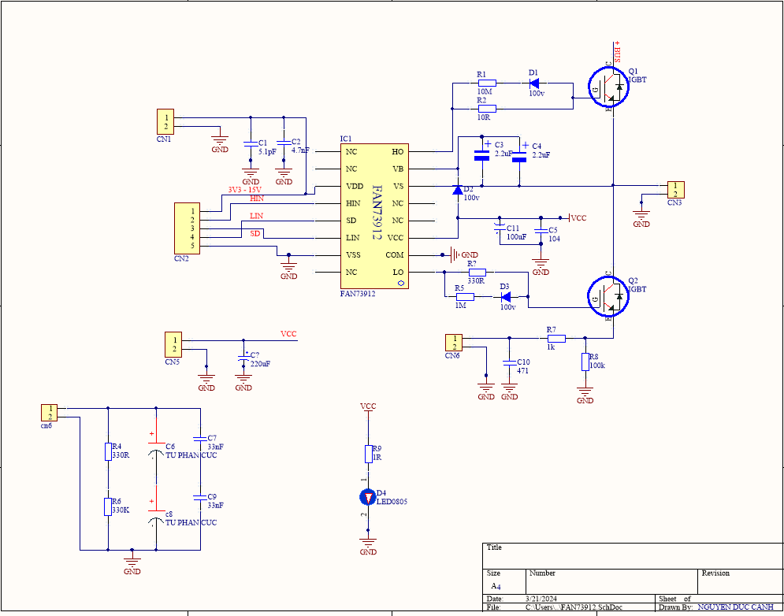

# ELE-D22-NguyenDucCanh - BÁO CÁO NGÀY 14/09/2024

# A. TỔNG QUAN VỀ PROJECT ĐÃ LÀM

# 1. Ngôn ngữ lập trình đã học

- C/C++

# 2. Vi điều khiển

- Arduino 

- ESP32

- STM32 (đang học): nút bấm, led 7 đoạn

### PROJECT

**ESP32 GIAO THỨC MQTT HIỂN THỊ NHIỆT ĐỘ, ĐỘ ẨM VÀ BẬT TẮT LED**

- Cài đặt MQTT Broker trên máy tính hoặc sử dụng dịch vụ MQTT public như CloudMQTT.

- MQTT Broker hay máy chủ mô giới được coi như trung tâm, nó là điểm giao của tất cả các kết nối đến từ Client (Publisher/Subscriber).

- Code và Demo: [CODE](https://github.com/eleptit-club/ELE-D22-NguyenDucCanh/tree/main/ESP/071324)

- Tham khảo: [Tham khảo](https://www.emqx.com/en/blog/esp32-connects-to-the-free-public-mqtt-broker)

# 3. Altium

**SCH mạch LED NEON**

**PCB**

**SCH Fan74912**

# 4. ĐIỂM MẠNH

- Em nắm tốt các kiến thức về lý thuyết mạch, điện tử số, điện tử tương tự.

# B. CÔNG VIỆC TIẾP THEO

- Em xin thầy cho em hướng nghiên cứu tiếp theo

